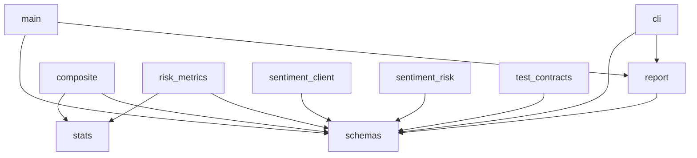

# Project Context

> **Auto-generated by [code-mapper](https://github.com/your-org/code-mapper).**  
> Read this file instead of scanning source files — it captures the full structure at a fraction of the token cost.
> `risk_calculator` · 16 files (python×16) · 23 classes · 50 functions · ~1,787 source lines

---
## File Structure

```
risk_calculator/
├── backend/
  └── __init__.py
  ├── app/
    └── __init__.py
    └── main.py
    ├── models/
      └── __init__.py
      └── schemas.py
    ├── services/
      └── __init__.py
      └── composite.py
      └── db.py
      └── report.py
      └── risk_metrics.py
      └── sentiment_client.py
      └── sentiment_risk.py
    ├── utils/
      └── __init__.py
      └── stats.py
└── cli.py
├── tests/
  └── test_contracts.py
```

## Class Diagram

```mermaid
classDiagram
    class AnalystRatings["AnalystRatings"] {
        +recommendation: str
        +target_mean_price: Optional
        +target_high_price: Optional
        +target_low_price: Optional
    }
    class LeadLagPoint["LeadLagPoint"] {
        +offset_days: int
        +correlation: float
    }
    class MarketMetrics["MarketMetrics"] {
        +vol_ann_30d: Optional
        +vol_ann_90d: Optional
        +vol_ann_1y: Optional
        +downside_deviation_ann: Optional
    }
    class MarketRiskBlock["MarketRiskBlock"] {
        +index: float
        +metrics: MarketMetrics
    }
    class Meta["Meta"] {
        +sentiment_fetched_at: str
        +price_data_as_of: str
        +benchmark: Optional
        +lookback_days: Optional
    }
    class PortfolioHolding["PortfolioHolding"] {
        +ticker: str
        +weight: float
    }
    class PortfolioRiskRequest["PortfolioRiskRequest"] {
        +holdings: List
        +benchmark: str
        +lookback_days: int
        +sentiment_api_url: Optional
    }
    class PortfolioRiskResponse["PortfolioRiskResponse"] {
        +as_of: str
        +portfolio_composite_score: float
        +portfolio_risk_bucket: str
        +diversification_ratio: Optional
    }
    class PortfolioTickerRisk["PortfolioTickerRisk"] {
        +ticker: str
        +weight: float
        +composite_risk_score: float
        +risk_bucket: str
    }
    class PriceCorrelation["PriceCorrelation"] {
        +pearson_r: Optional
        +divergence_alert: bool
        +divergence_direction: Optional
        +lead_lag: List
    }
    class Recommendations["Recommendations"] {
        +suggested_stop_loss_pct: Optional
        +kelly_fraction_capped: Optional
        +position_size_pct_of_account: Optional
        +position_size_usd: Optional
    }
    class RiskRequest["RiskRequest"] {
        +ticker: str
        +company_name: Optional
        +lookback_days: int
        +benchmark: str
    }
    class RiskResponse["RiskResponse"] {
        +ticker: str
        +as_of: str
        +composite_risk_score: float
        +risk_bucket: Literal
    }
    class SentimentArticle["SentimentArticle"] {
        +title: str
        +source: str
        +published_at: str
        +sentiment: Literal
    }
    class SentimentContractError["SentimentContractError"] {
    }
    class SentimentMetrics["SentimentMetrics"] {
        +total_articles: int
        +positive_count: int
        +negative_count: int
        +neutral_count: int
    }
    class SentimentResponse["SentimentResponse"] {
        +ticker: str
        +company_name: str
        +overall_sentiment: Literal
        +confidence: float
    }
    class SentimentRiskBlock["SentimentRiskBlock"] {
        +index: float
        +metrics: SentimentRiskMetrics
    }
    class SentimentRiskMetrics["SentimentRiskMetrics"] {
        +negative_ratio: Optional
        +dispersion: Optional
        +momentum_24h_vs_7d: Optional
        +recency_weighted_sentiment: Optional
    }
    class SentimentServiceDownError["SentimentServiceDownError"] {
        +__init__()
    }
    class StressScenario["StressScenario"] {
        +name: str
        +shock_pct: float
        +new_var_95: Optional
        +new_composite_score: Optional
    }
    class TopicKeyword["TopicKeyword"] {
        +keyword: str
        +count: int
        +avg_sentiment: float
    }
    class Weights["Weights"] {
        +market: float
        +sentiment: float
    }
```



## Module Dependencies



## Symbol Index


**`backend\app\main.py`** `python`
> FastAPI entry point for risk_calculator.
- `def health()`
- `def risk(req: RiskRequest) → RiskResponse`
- `def portfolio_risk(req: PortfolioRiskRequest) → PortfolioRiskResponse`  — Multi-ticker portfolio risk endpoint.
- `def get_risk_history(ticker: str, limit: int)`  — Return historical risk snapshots for a ticker (newest first).

**`backend\app\models\schemas.py`** `python`
> Pydantic models matching the JSON Schemas in contracts/.
- `class TopicKeyword(BaseModel)`
- `class AnalystRatings(BaseModel)`
- `class LeadLagPoint(BaseModel)`
- `class PriceCorrelation(BaseModel)`
- `class Weights(BaseModel)`
- `class RiskRequest(BaseModel)`
- `class SentimentArticle(BaseModel)`
- `class SentimentMetrics(BaseModel)`
- `class SentimentResponse(BaseModel)`
- `class MarketMetrics(BaseModel)`
- `class SentimentRiskMetrics(BaseModel)`
- `class MarketRiskBlock(BaseModel)`
- `class SentimentRiskBlock(BaseModel)`
- `class Recommendations(BaseModel)`
- `class Meta(BaseModel)`
- `class StressScenario(BaseModel)`
- `class RiskResponse(BaseModel)`
- `class PortfolioHolding(BaseModel)`
- `class PortfolioRiskRequest(BaseModel)`
- `class PortfolioTickerRisk(BaseModel)`
- `class PortfolioRiskResponse(BaseModel)`

**`backend\app\services\composite.py`** `python`
> Normalize sub-metrics to 0-100 risk contributions and combine into a composite score.
- `def compute_indices(market: MarketMetrics, sentiment: SentimentRiskMetrics) → Tuple`
- `def dynamic_sentiment_weight(total_articles: int, confidence: float, base_weight: float, min_weight: float) → float`  — Scale sentiment weight based on data quality.
- `def composite_score(market_idx: float, sentiment_idx: float, w_market: float, w_sentiment: float) → float`
- `def bucket(score: float) → str`

**`backend\app\services\db.py`** `python`
> SQLite-based historical risk tracking.
- `def init_db() → None`  — Create the risk_snapshots table and index if they don't exist.
- `def save_snapshot(report: Dict, session: str) → None`  — Persist one RiskResponse (as a dict) to the DB.
- `def get_history(ticker: str, limit: int) → List`  — Return the last *limit* snapshots for *ticker*, newest first.

**`backend\app\services\report.py`** `python`
> Assemble the final RiskResponse.
- `def build_report(req: RiskRequest, market: MarketMetrics, sentiment: SentimentRiskMetrics, s_resp: SentimentResponse) → RiskResponse`

**`backend\app\services\risk_metrics.py`** `python`
> Market-based risk sub-metrics.
- `def rolling_vol_annual(returns: Series, window: int) → Optional`
- `def downside_deviation_annual(returns: Series, mar: float) → Optional`
- `def historical_var(returns: Series, alpha: float) → Optional`
- `def parametric_var(returns: Series, alpha: float) → Optional`
- `def conditional_var(returns: Series, alpha: float) → Optional`
- `def max_drawdown(prices: Series) → Tuple`
- `def beta(asset_returns: Series, bench_returns: Series) → Optional`
- `def sharpe_ratio(returns: Series, rf_annual: float) → Optional`
- `def sortino_ratio(returns: Series, rf_annual: float) → Optional`
- `def skewness(returns: Series) → Optional`
- `def excess_kurtosis(returns: Series) → Optional`
- `def atr14_pct(ohlc: DataFrame, period: int) → Optional`
- `def gap_risk_frequency(ohlc: DataFrame, sigma_mult: float) → Optional`  — Fraction of overnight gaps whose magnitude exceeds sigma_mult * realized daily s
- `def premarket_gap_pct(ticker: str) → Optional`  — Signed pre-market gap for today: (first pre-market open - prior regular close) /
- `def liquidity_score(ohlc: DataFrame) → Optional`  — 0-100 score: higher = more liquid. Based on avg dollar volume and zero-volume sh
- `def range_52w_position(prices: Series) → Optional`
- `def compute_market_metrics(ohlc: DataFrame, bench_ohlc: DataFrame, rf_annual: float, ticker: Optional) → MarketMetrics`

**`backend\app\services\sentiment_client.py`** `python`
> HTTP client for the companion sentiment_analysis service.
- `class SentimentServiceDownError(RuntimeError)`  — Raised when the sentiment_analysis service is unreachable.
- `class SentimentContractError(RuntimeError)`  — Raised when the upstream response violates the JSON Schema contract.
- `def check_health(base_url: str, timeout: float) → bool`
- `def fetch_sentiment(ticker: str, company_name: str, base_url: str, timeout: float) → SentimentResponse`  — Call POST /api/analyze and return a validated SentimentResponse.
- `def load_sentiment_from_file(path: str) → SentimentResponse`  — Dev-only: load a cached sentiment_analysis JSON file (e.g. msft_result.json).

**`backend\app\services\sentiment_risk.py`** `python`
> Sentiment-derived risk sub-metrics computed from SentimentResponse.
- `def negative_ratio(resp: SentimentResponse) → Optional`
- `def dispersion(articles: List) → Optional`
- `def momentum_24h_vs_7d(articles: List) → Optional`
- `def recency_weighted_sentiment(articles: List, half_life_hours: float) → Optional`
- `def news_volume_zscore(articles: List) → Optional`  — Z-score of today's article count vs prior 7-day baseline.
- `def source_concentration_hhi(resp: SentimentResponse) → Optional`
- `def extreme_score_share(articles: List, threshold: float) → Optional`
- `def polarity_gap(resp: SentimentResponse) → Optional`
- `def compute_sentiment_metrics(resp: SentimentResponse) → SentimentRiskMetrics`

**`backend\app\utils\stats.py`** `python`
> Small statistical helpers.
- `def log_returns(prices: Series) → Series`
- `def annualize_vol(daily_returns: Series) → Optional`
- `def clip01(x: float) → float`
- `def piecewise_score(value: float, low: float, high: float) → float`  — Map a raw value to 0-100 risk contribution, linear between thresholds.

**`cli.py`** `python`
> Risk Calculator CLI.
- `def main() → int`

**`tests\test_contracts.py`** `python`
> Validate contract schemas and Pydantic models against the sample msft_result.json.
- `def test_all_contracts_parse_as_json_schema()`
- `def test_sample_matches_sentiment_response_schema()`
- `def test_sample_parses_as_pydantic_model()`
- `def test_risk_request_defaults()`